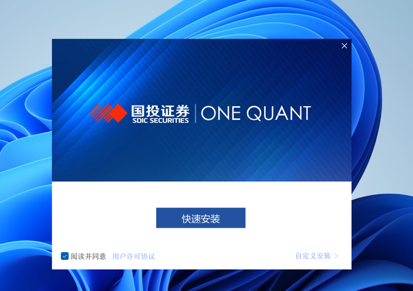
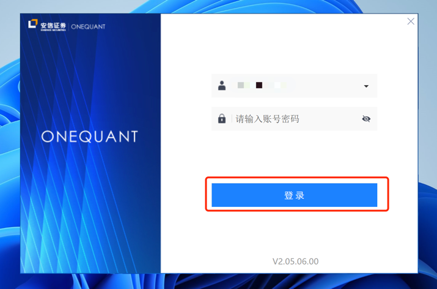
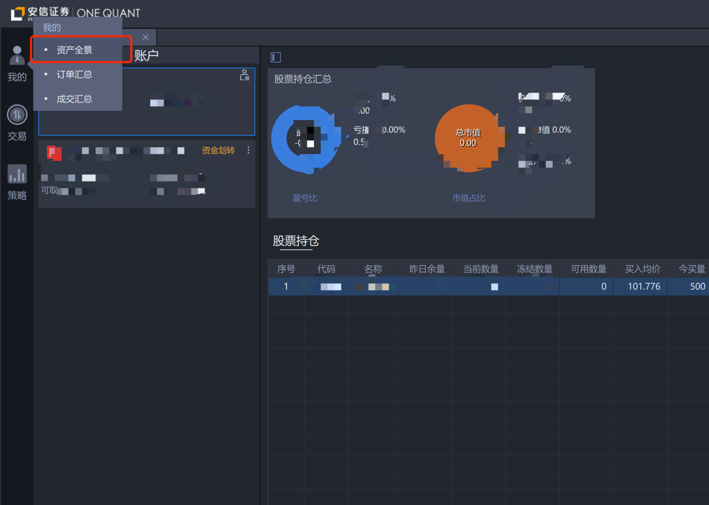
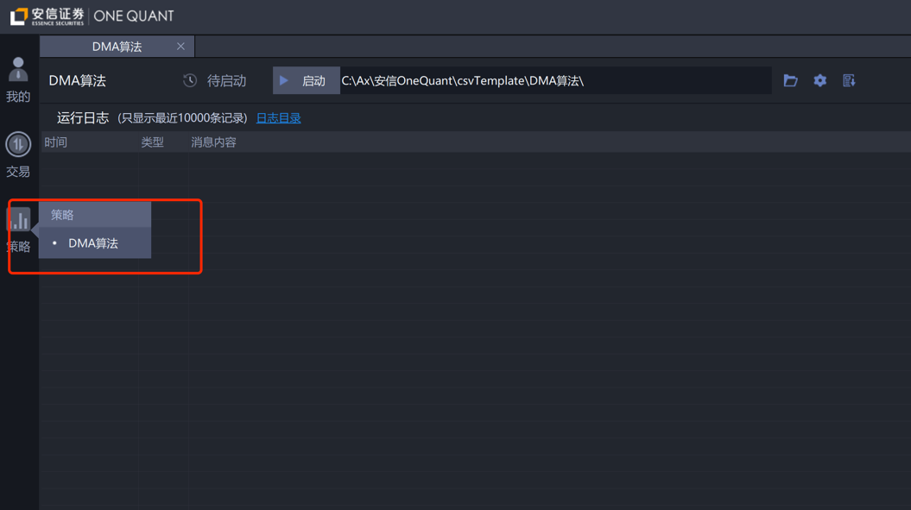
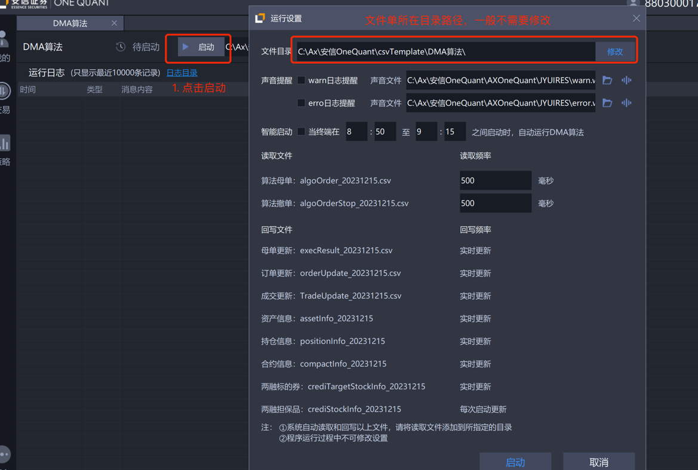

# jqtrade

jqtrade是一个支持用户在本地电脑上运行实盘任务的框架, 它提供了：
1. 策略代码框架. 用户在策略代码中通过jqtrade可以设置策略进程启动时的工作以及定时任务，策略进程启动后会根据用户策略代码的设置来定时运行用户定义的函数 
2. 交易和账户管理相关API. 用户可以通过这些API进行实盘下单、撤单、查询资金、持仓等. 
3. 为用户提供默认的实盘交易接口. 在jqtrade内部, 已经默认实现了对接安信证券one quant DMA交易的接口, 可以直接通过上述API与你的资金账户进行交互. 只需在策略中设置好资金账户和交易接口配置即可.  

# 快速上手
## 安装
1. 安装python. 需要安装3.6.2 ~ 3.9.18版本范围内的的python, 请参考python官网的安装文档安装python. 
2. 安装jqtrade. 可以直接使用`pip`来安装jqtrade
```bash
pip install jqtrade
```
或直接clone安装
```bash
pip install git+https://gitee.com/wow_zihao/jqtrade.git
或
pip install git+https://github.com/ZiaWang/jqtrade.git
```

注意：windows系统安装时，可能会遇到安装`pyuv`库的报错，可以参考下面[pyuv安装问题](#pyuv安装问题)解决

3. 申请并安装安信one quant DMA算法使用权限. 申请步骤：[安信one quant DMA交易申请步骤](#安信onequant交易申请步骤). 如果你对python比较熟悉, 且有自己的实盘接口渠道, 可以自己实现一个jqtrade.account.AbsTradeGate的子类来替换jqtrade中默认的trade gate

## 策略代码
完成上述安装步骤之后, 就可以开始实现策略代码了, 下面是一个策略代码的示例：
```python
# -*- coding: utf-8 -*-

def process_initialize(context):
    log.info("process_initialize run.")

    set_options(
        account_no="1234567",           # 资金账号
        # order_dir = "C:\Ax\国投OneQuant\csvTemplate\DMA算法",      # 安信one quant DMA算法文件单目录路径
        # file_encoding="GBK",          # 安信one quant DMA算法文件单编码，如果系统文件编码不是GBK的话，这里需要指定
    )
    
    run_daily(before_market_open, "open-30m")
    run_daily(market_open, "open")
    run_daily(market_1000, "10:00:00")
    run_daily(market_close, "close")
    run_daily(after_market_close, "close+30m")
    run_daily(do_order, "every_minute")


# 自定义的全局变量, 策略进程退出时会释放, 若需持久化, 请直接在策略代码中写到文件中
g = {}


def before_market_open(context):
    log.info("before_market_open run")

    log.info(f"当前总资产： {context.portfolio.total_value}")
    log.info(f"当前锁定金额：{context.portfolio.locked_cash}")
    log.info(f"当前可用资金：{context.portfolio.available_cash}")
    log.info(f"当前多头持仓：{context.portfolio.long_positions}")
    log.info(f"当前空头持仓：{context.portfolio.short_positions}")

    
def market_open(context):
    log.info("market_open run")

    
def market_1000(context):
    log.info("market_1000 run")

    
def do_order(context):
    log.info("do_order run")

    pos = context.portfolio.long_positions["000001.XSHE"]
    if pos.closeable_amount > 0:
        g["order_id_000001"] = order("000001.XSHE", -pos.closeable_amount, LimitOrderStyle(10))
    
    if "000002.XSHE" not in context.portfolio.long_positions:
        g["order_id_000002"] = order("000002.XSHE", 100, MarketOrderStyle())
    
    orders = get_orders()
    for _order_id, _order in orders.items():
        if _order.status in ("new", "open"):
            log.info(f"查询到未完成订单：{_order}")
            cancel_order(_order_id)

    
def market_close(context):
    log.info("market_close run")

    
def after_market_close(context):
    log.info("after_market_close run")
```

策略代码中提供了基本下单、撤单、查询资金、持仓、订单的API接口, 关于这些API的详细使用, 见下面：[策略框架](#策略框架)

## 启动策略
使用jqtrade提供的`start_task`命令可以很方便的快速启动实盘策略. 

示例：
```bash
# 启动一个策略名称为'demo'的实盘策略, 策略代码路径是'strategies/demo_strategy.py'
python -m jqtrade start_task -c strategies/demo_strategy.py -n demo
```
或
```bash
jqtrade start_task -c strategies/demo_strategy.py -n demo
```

**注意**:
* 实盘策略的名称需要唯一, 不能在同一台机器上启动多个相同名称的实盘任务
* 策略代码所在目录会自动添加到sys.path, 因此你可以在策略代码中导入你自定义的模块（支持.py和.so模块, 导入.so模块时, 请注意是否与当前python版本匹配）

## 查看当前运行的策略
如果你想查看当前机器上运行了哪些实盘任务, 可以使用get_tasks命令. 

示例：
```bash
# 启动一个策略名称为'demo'的实盘策略, 策略代码路径是'strategies/demo_strategy.py'
python -m jqtrade get_tasks
```
或
```bash
jqtrade get_tasks
```

## 停止运行中的策略
如果你想停止当前机器上运行的某个实盘任务, 可以使用stop_task命令. 

```bash
python -m jqtrade stop_task -n demo
```
或
```bash
jqtrade stop_task -n demo
```

start_task、stop_task除了上述示例中的常用参数之外, 还有其他更详细的命令介绍, 见：[命令参考](#命令参考)

# 使用说明
## 命令参考
在安装完jqtrade之后, 就可以使用`python -m jqtrade`或直接使用`jqtrade`来执行相关命令了. 

jqtrade目前提供了三个子命令, 分别是：
* start_task: 启动策略进程
* stop_task: 停止策略进程
* get_tasks: 查询策略进程

jqtrade本身以及其每一个子命令都可以使用 `-h` 选项查看子命令的详细参数和介绍.

获取子命令介绍：
```bash
# jqtrade --help
usage: __main__.py [-h] [-V] {start_task,get_tasks,stop_task} ...

positional arguments:
  {start_task,get_tasks,stop_task}
    start_task          创建新的实盘任务
    get_tasks           查询当前运行中的实盘任务
    stop_task           停止运行中的实盘任务

optional arguments:
  -h, --help            show this help message and exit
  -V, --version         获取版本信息
```

获取start_task介绍：
```bash
# jqtrade start_task --help 
usage: __main__.py start_task [-h] -n NAME -c CODE [-o OUT] [-e ENV] [--config CONFIG] [--debug]

optional arguments:
  -h, --help            show this help message and exit
  -n NAME, --name NAME  实盘任务名称, 唯一标识该实盘任务, 不能重复
  -c CODE, --code CODE  策略代码路径
  -o OUT, --out OUT     日志路径, 不指定时打印到标准输出/错误
  -e ENV, --env ENV     指定实盘策略进程运行环境变量, 多个环境变量使用分号分隔, 示例: -e PYTHONPATH=./package;USER=test
  --config CONFIG       指定自定义配置文件路径
  --debug               是否开启debug模式, debug模式日志更丰富些
```

### start_task
```bash
start_task [-h] -n NAME -c CODE [-o OUT] [-e ENV] [--config CONFIG] [--debug]
```
start_task用于启动策略进程, 该子命令选项如下：
* **必须提供**:
    * -n NAME, --name NAME: 实盘任务名称, 唯一标识该实盘任务, 同一台机器不能重复
    * -c CODE, --code CODE: 策略代码路径
* 可选项:
    * -o OUT, --out OUT: 日志路径, 不指定时打印到控制台标准输出/错误
    * -e ENV, --env ENV: 指定实盘策略进程运行环境变量, 多个环境变量使用分号分隔. 示例: -e PYTHONPATH=./package;USER=test
    * --debug: 是否开启debug模式, debug模式日志更丰富些，会包含更多的jqtrade系统日志.
    * --config CONFIG: 指定自定义配置文件路径, 除非你对jqtrade的配置管理很熟悉, 否则不建议使用.

示例:
```bash
jqtrade start_task -c strategies/demo.py -n demo -o demo.log -e 'PYTHONPATH=/home/server/strategy_utils'
```

**注意：`-e` 指定的环境变量，对于PYTHONPATH，jqtrade会将指定的路径信息insert到sys.path中**

### stop_task
```bash
stop_task [-h] [-n NAME] [-p PID] [--all] [-f]
```
stop_task用于停止运行中的策略进程，该子命令选项如下：
* 以下三个选项至少提供一个:
    * -n NAME, --name NAME: 通过指定实盘名称来停止实盘
    * -p PID, --pid PID: 通过指定实盘进程pid来停止实盘, 策略进程的pid可以通过 `get_tasks` 命令查询到，或直接通过系统查询
    * --all: 停止所有运行中的实盘任务, 当指定此选项的时候，会忽略`-n`和`-p`选项
* 可选项:
    *  -f, --force           是否强制杀掉策略进程，不指定时，会等待策略进程处理完当前事务再退

**注意**:
* 如果你的策略进程没有后台运行，而是在当前终端对话框中正在运行的，可以直接使用`ctrl + c` 来快速停止策略。jqtrade内部会监听`ctrl + c`发送的信号，然后安全的停止当前策略进程
* 关于停止策略进程的时间:
    * 不指定`-f`或`--force`时，策略进程会在处理完当前的事务之后，再执行信号处理。
    * 指定`-f`或`--force`时，策略进程会被系统直接杀掉，不管当前是否正在处理事务

### get_tasks
```bash
get_tasks [-h]
```
get_tasks用于查询当前机器上所有运行中的策略进程，并打印策略进程的启动参数和进程信息。

**注意**:
* 用户使用`stop`停止策略进程命令前，可以通过`get_tasks`命令查询当前运行中的策略进程，根据策略进程的任务名称或pid来停止对应的策略进程


## 策略框架
策略框架分成两部分：策略调度模块(scheduler)、账户管理模块(account)
* scheduler模块实现策略代码的调度逻辑，用于驱动用户策略代码根据实际物理时间来运转
* account模块用于管理子账户，用户在策略代码中调用的下单、撤单、查询API会通过account模块的交易接口(trade gate)与券商柜台通信，并且account模块会定时通过交易接口从券商柜台同步最新的订单状态、账户资金、账户持仓信息到本地

对于策略任务调度，用户只需要实现`process_initialize`函数，在该函数中调用jqtrade提供的`run_daily`函数设置自己的定时任务，在策略进程启动后，就会根据用户设置的时间来驱动用户定时任务函数的执行。

对于账户管理，用户只需要在策略代码的`process_initialize`函数中，调用`set_options`来设置一些必要初始化参数即可，有关`set_options`所支持的选项和用法，见：[set_options](#set_options)

### process_initialize
`process_initialize(context)`函数是用户需要在策略代码中自己定义并实现的一个函数，并且该函数要有一个参数`context`，在该函数中，用户需要设置交易接口所需的必要参数、定时任务。
`context`参数是jqtrade提供给用户的一个API对象，它具有一些属性方便用户来查询数据，详情见下面的介绍：[context](#context)

示例:
```python
# -*- coding: utf-8 -*-

def process_initialize(context):
    # 设置交易接口所需的账户信息
    set_options(account_no="1234567")
    
    # 设置定时任务
    run_daily(func, "09:30:00")


def func(context):
    pass
```

**注意**:
* process_initialize会在策略进程启动时先执行，因此，用户自己额外的一些初始化操作可以放到process_initialize中

### run_daily
`run_daily(func, time)`用于设置定时任务，参数介绍如下：
* func: 用户自己定义和实现的函数，该函数的位置参数为`context`
* time: 支持多种方式指定时间:
    * 格式为`HH:MM:SS`格式的时间字符串，比如`09:30:30`，支持精确到秒
    * open: 等价于`09:30:00`，jqtrade默认开盘时间是09:30:00
    * close: 等价于`15:00:00`, jqtrade默认收盘时间是15:00:00
    * every_minute: 等价于交易时间段每分钟执行(09:30:00\~11:30:00, 13:00:00\~15:00:00)

**注意**:
* `run_daily`只能在`process_initialize`中调用，在其他地方调用会报错。

### set_options
`set_options(**kwargs)`用于给策略进程传递策略选项，从而控制策略进程中的一些行为。
set_options支持的选项分成两类，一类是策略调度模块选项(scheduler)，另一类是账户管理模块选项(account)。
* 策略调度模块选项是针对策略调度逻辑的，用来控制策略框架的一些调度行为
* 账户管理模块选项是针对与账户模块和交易接口(trade gate)，jqtrade默认给用户提供了`安信DMA交易接口(AnXinDMATradeGate)`，参考下方[安信OneQuant交易申请步骤](#安信onequant交易申请步骤)申请开通one quant，即可直接使用内置`安信DMA交易接口(AnXinDMATradeGate)`
  * jqtrade支持用户自己实现交易接口，用户只需创建`account.trade_gate.AbsTradeGate`子类，在子类中根据自己的交易接口实现相关接口即可
  

一般情况下，我们使用`安信DMA交易接口时`，set_options只需要设置`account_no`即可，如果你安装`安信one quant`时指定了自定义安装目录或者发现默认安装目录不是`C:\Ax\国投OneQuant\csvTemplate\DMA算法\`，就需要通过set_options的`order_dir`来设置文件单路径，示例：
```python

set_options(
    account_no="12345",         # 策略交易使用的资金账号
    order_dir="C:\Ax\国投OneQuant\csvTemplate\DMA算法",         # 安信one quant DMA交易文件单路径
    file_encoding="GBK",          # 安信one quant DMA算法文件单编码，如果系统文件编码不是GBK的话，这里需要指定，默认是sys.getfilesystemencoding()
)

```


策略调度模块支持的选项:
* `runtime_dir`: 设置策略进程运行时目录
  * 选项值类型：str
  * 默认值："~/jqtrade"
* `use_account`: 是否加载account账户管理模块，选择不加载时jqtrade将只提供定时调度的功能，账户管理相关API将不能使用
  * 选项值类型：bool
  * 默认值：False
* `market_period`: 交易时间段，目前会影响`run_daily`中`time是"every_minute"、"open"、"close"`的行为. 
  * 选项值类型：list of tuple
  * 默认值：`[("09:30:00", "11:30:00""), ("13:00:00", "15:00:00")]`
  * 与`run_daily`的"time"参数对应关系:
    * "every_minute": 程序会选取`market_period`区间每一分钟运行对应用户函数
    * "open": 程序会选取`market_period[0][0]`作为开盘时间
    * "close": 程序会选取`market_period[-1][-1]`作为开盘时间

账户管理模块支持的选项:
* `安信DMA交易接口(AnXinDMATradeGate)`专用选项:
  * `account_no`: 资金账号（**使用安信交易接口时，必须设置此选项**）
    * 选项值类型：str
  * `order_dir`: 安信DMA交易接口文件单路径（**安信one quant安装目录与此默认值不同时，必须设置此选项**）
    * 选项值类型：str
    * 默认值：C:\Ax\国投OneQuant\csvTemplate\DMA算法
    * 注意：当在安信one quant上启动该DMA交易之后，请确认设置的导出文件目录与此默认值是否一致，若不一致，请在set_options中设置实际路径
  * `file_encoding`: 安信文件单的文件编码
    * 选项值类型：str
    * 默认：sys.getfilesystemencoding()
  * `account_type`: 策略账户类型 
    * 选项值类型：str
    * 默认值: STOCK
  * `counter_type`: 柜台类型
    * 选项值类型：str
    * 默认值: UM0
    * 支持的值: 
        * UM0 普通股票账户【默认此类型】
        * UF0 金证极速股票账户
        * AT0 华锐极速股票账户
    * 注意：
        * 此"柜台类型"可联系安信客户经理修改，修改后在策略代码中指定新的柜台类型后方可交易。
        * 与真实资金账户不匹配的`counter_type`柜台类型，将导致下单失败，一般用户默认都是UM0类型，不需要自己再专门设置。
  * `algo_type`: 算法交易类型
    * 选项值类型: str
    * 默认值: DMA
    * 注意：当前仅支持DMA
  * `wait_lock_internal`: 写安信DMA文件单时，要用到文件锁，避免文件被同时多线程写，此选项为文件锁轮训间隔，单位：秒
    * 选项值类型：float
    * 默认: 0.05
  * `wait_lock_time_out`: 写安信DMA文件单时，获取文件锁的超时时间，单位：秒
    * 选项值类型：float
    * 默认: 5
  * `sync_retry_kwargs`: 从安信文件单同步资金、持仓、订单数据时，异常重试参数
    * 选项值类型：dict，有`max_attempts`和`attempt_internal`两个key
      * max_attempts：最大重试次数，默认3次
      * attempt_internal：重试间隔，单位：秒，默认0.15秒
  * `ignore_error_line`: 解析订单状态文件时，是否忽略掉解析失败的订单信息
    * 默认: True，将忽略解析失败的订单状态信息。
    * 注意: 
        * 一般解析失败都是由于文件编码异常导致，通过设置`file_encoding`选项来设置文件单对应的正确编码，然后重启策略进程。策略进程重启后，
      会从头开始重新加载订单状态。
        * `ignore_error_line=True`时，解析不了的订单状态数据会在当前策略进程生命周期内被忽略，要想重新加载该条订单状态，需重启策略进程。
* 账户管理模块专用选项:
  * `sync_balance`: 是否启用资金、持仓定时同步功能
    * 选项值类型：bool
    * 默认: True
  * `sync_order`: 是否启用订单定时同步功能
    * 选项值类型：bool
    * 默认: True
  * `sync_internal`: 每次同步时间间隔，单位：秒
    * 选项值类型：float
    * 默认5秒
  * `sync_period`: 同步时间区间，不设置时，默认启动后一直同步，不管当前是否是交易时间。
    * 选项值类型：list of tuple
    * 默认: 不设置，启动后一直同步
    * 示例：`[("09:30:00", "11:30:00""), ("13:00:00", "15:00:00")]`


**注意**：
* 账户管理模块的选项和交易接口选项区分开，是因为前者是固定不变的，后者如果用户自己开发交易接口的话，就可以自定义交易接口选项。
* 用户自己开发的交易接口，在setup函数中可以通过options参数获取所有策略中传递的选项


## 其他策略API
### order
下单API，用户在策略中通过调用此API下单。
```python
order(code, amount, style=None, side='long')
```

参数介绍：
* code: 股票代码字符串，上交所后缀`XSHG`，深交所后缀`XSHE`，例如："000001.XSHE"、"600000.XSHG"
* amount: 委托数量，正数表示买入，负数表示卖出，不能为0
* style: 类似聚宽官网style参数，值类型:
    * LimitOrderStyle: 限价单，需要指定订单价格。例如: LimitOrderStyle(11.11)。使用安信OneQuant时，设置style=LimitOrderStyle(0)，委托价格会自动设置为对手盘的一档价格下单
    * MarketOrderStyle: 市价单，不需要指定订单价格。例如: MarketOrderStyle()。安信OneQuant目前不支持市价单，但可以通过设置style=LimitOrderStyle(0)的方式以对手盘的一档价格下单
* side: 买卖方向，支持"long"、"short"两种，目前jqtrade仅支持"long"方向的交易

返回值:
* 返回jqtrade内部委托id。此id由jqtrade随机生成，用于唯一标识该笔内部订单

示例：
```python
# 买入100股000001.XSHE，委托价格11.11元
order("000001.XSHE", 100, LimitOrderStyle(11.11))

# 卖出100股600000.XSHG，委托价格5元
order("600000.XSHG", -100, LimitOrderStyle(5))

# 以买一档价格卖出100股600000.XSHG
order("600000.XSHG", -100, LimitOrderStyle(0))

# 以买一档价格买入100股000001.XSHE
order("000001.XSHE", 100, LimitOrderStyle(0))
```

**注意**:
* **安信交易接口暂时不支持市价单交易，下单会被废单并提示价格错误。**

### cancel_order
撤单API，用户在策略中通过调用此API撤单。
```python
cancel_order(order_id)
```

参数介绍：
* order_id: jqtrade内部委托id。`order`下单时会返回此id，另外get_orders返回的订单对象中，调用对象的`order_id`属性也可以获取内部订单id

返回值: 
* None

示例:
```python
order_id = order("600000.XSHG", -100, LimitOrderStyle(5))
cancel_order(order_id)


for _order in get_orders():
    if _order.status != "filled":
        cancel_order(_order.order_id)
```

### batch_submit_orders
批量下单API，用户在策略中通过调用此API实现批量下单
```python
batch_submit_orders(orders)
```

参数介绍：
* orders: list of dict. 每一个dict用于存放单笔订单的信息，每笔订单需要提供：
  * **必要字段**：code, amount
  * 可选字段：style, side
  * 这些字段的字段名以及默认值都与`order`函数一致
  
返回值:
* list. 存放内部订单id字符串(同order函数返回值), 如果批量单中某笔订单委托柜台失败，就会返回None

**注意**：
* 批量单中某笔订单委托失败不会导致所有订单失败

示例：
```python
batch_submit_orders([
  {"code": "000001.XSHE", "amount": 100, "style": LimitOrderStyle(11.11), "side": "long"},
  {"code": "600000.XSHG", "amount": -100, "style": LimitOrderStyle(5)},
])
```

### batch_cancel_orders
批量撤单API，用户在策略中通过调用此API实现批量撤单
```python
batch_cancel_orders(order_ids)
```

参数介绍：
* order_ids: list of order_id

返回值：None

示例：
```python
batch_cancel_orders(["12345", "67890"])
```

### get_orders
查询订单API，用户在策略中通过调用此API实现订单查询
```python
get_orders(order_id=None, code=None, status=None)
```

参数介绍：
* get_orders提供了三个过滤参数`order_id`, `code`, `status`，这三个参数可以一起组合使用("与"条件过滤)，不指定时查询所有订单
* order_id: 内部委托id，查询指定内部id的委托
* code: 标的代码字符串，查询指定标的的委托
* status: 订单状态字符串，查询指定状态的委托，status支持字符串状态值或[OrderStatus类型的状态值](#orderstatus)，状态值包括：
  * "new": 新创建的订单，还没有收到柜台委托确认
  * "open": 订单已收到委托确认
  * "filling": 订单成交部分，正在撮合中
  * "filled": 订单全部笔成交
  * "canceling": 订单撤单处理中
  * "partly_canceled": 订单部分撤单
  * "canceled": 订单全部撤单
  * "rejected": 订单废单

返回值：
* dict. key是内部订单id，value是一个UserOrder对象，每一个UserOrder对象对应一笔委托订单

**注意**
* get_orders返回的UserOrder对象是一个快照，其对象内的状态不会改变，即get_orders返回的是当前时间点内存中订单的状态数据，如果其后订单状态变化了，get_orders返回的该UserOrder对象不会变化。


### OrderStatus
订单状态枚举类型，可以通过属性的方式获取状态值
支持：
* `OrderStatus.new`: 新创建的订单，还没有收到柜台委托确认
* `OrderStatus.open`: 订单已收到委托确认
* `OrderStatus.filling`: 订单成交部分，正在撮合中
* `OrderStatus.filled`: 订单全部笔成交
* `OrderStatus.canceling`: 订单撤单处理中
* `OrderStatus.partly_canceled`: 订单部分撤单
* `OrderStatus.canceled`: 订单全部撤单
* `OrderStatus.rejected`: 订单废单


### UserOrder
订单对象，存放订单信息，用户可以通过该对象属性获取订单数据。

UserOrder包含以下属性：
* order_id: 内部订单id
* code: 股票代码 
* status: 订单状态字符串，对应以下状态：
  * "new": 新创建的订单，还没有收到柜台委托确认
  * "open": 订单已收到委托确认
  * "filling": 订单成交部分，正在撮合中
  * "filled": 订单全部笔成交
  * "canceling": 订单撤单处理中
  * "partly_canceled": 订单部分撤单
  * "canceled": 订单全部撤单
  * "rejected": 订单废单
* side: 订单方向
* style: 订单style
* order_price: 委托价格
* amount: 委托数量
* filled_amount: 成交数量
* canceled_amount: 撤单数量
* avg_price: 成交均价
* deal_balance: 成交额
* action: 表示订单时开仓还是平仓，对应：
    * open：开仓
    * close：平仓
* commission: 手续费
* err_msg: 异常消息
* create_time: 创建时间
* entrust_time: 委托确认时间

### log
logging.Logger日志对象，用户可以使用此对象打印日志，使用方法与logging模块一致。


### print
jqtrade对策略中的print做了一层封装，用户使用方式跟python内置的print是一样的，但是会根据用户是否在启动策略时指定日志文件`-o/--out`来做一个重定向。
print封装后行为如下：
* 当用户没有指定`-o/--out`选项时，print仍是打印到标准输出，跟官网默认print没区别
* 当用户指定了`-o/--out`选项时:
  * 如果用户print函数指定了`file`参数，则print输出到用户自定义的文件中
  * 如果用户print函数没有指定`file`参数，则print输出到`-o/--out`对应的日志文件中


### context
策略上下文对象，用于一些查询，目前有以下属性供查询：
* current_dt: 当前真实物理时间，datetime.datetime对象
* strategy_dt: 当前策略逻辑时间，即当前处理的定时任务对应的时间，datetime.datetime对象
* portfolio：Portfolio对象，整合了账户模块的一些数据信息供查询。

### portfolio
Portfolio通过context.portfolio来访问，它用来访问账户模块的一些数据，目前支持：
* total_value: 账户总资产，float类型
* available_cash: 账户可用资金，float类型
* locked_cash: 账户冻结资金，float类型
* long_positions: 多头持仓，一个dict，key是标的代码字符串，value是一个UserPosition对象
* positions: 同"long_positions"，为了方便兼容聚宽策略保留的属性
* short_positions: 空头持仓，一个dict，key是标的代码字符串，value是一个UserPosition对象

### UserPosition
持仓对象，封装账户当前的某个持仓信息。

UserPosition包含以下属性：
* code: 股票代码
* total_amount: 持仓数量
* locked_amount: 冻结持仓数量
* closeable_amount: 可用持仓数量
* avg_cost: 平均成本
* acc_avg_cost: 同"avg_cost"，为了方便兼容聚宽策略保留的属性
* side: 持仓方向，同订单的方向一样，long表示多头持仓，short表示空头持仓
* last_price: 最新价格
* price: 同"last_price"，为了方便兼容聚宽策略保留的属性
* position_value: 最新持仓市值
* value: 同"position_value"，为了方便兼容聚宽策略保留的属性

### sync_balance
此API用于主动通过交易接口同步资金、持仓到本地。
jqtrade默认是每隔5秒同步一次最新资金和持仓到本地，如果用户想获取最新的账户资金、持仓信息，可以在策略代码中直接调用此函数
```python
sync_balance()
```

### sync_orders
此API用于主动通过交易接口同步订单到本地。
jqtrade默认是每隔5秒同步一次最新订单状态到本地，如果用户想尽快更新内存中订单状态，可以在策略代码中直接调用此函数
```python
sync_orders()
```

# 安信OneQuant交易申请步骤
步骤：开户 -> 申请开通OneQuant交易系统DMA算法权限 -> 安装OneQuant -> 登录与使用 

详细见下面介绍。

## 1. 开户


1. 手机扫描上方二维码或点击链接：https://sjkh.essence.com.cn/h5kh/index.htm?qd=jka0007395&branch=8803&pt=crm
2. 点击“新开户申请”，填写手机号并勾选《安信证券用户服务协议》,获取验证码后点击“马上开户”
3. 营业网点选择“深圳安信金融大厦证券营业部”，介绍人数字ID信息勾选“无”，同意签署《开户协议》后点击“下一步”。
4. 根据开户引导完成视频录制、以及资金账户密码、交易密码设置、风险测评等。

OneQuant股票交易佣金费率：万2.5


## 2. 开通安信OneQuant交易系统DMA算法权限
开户完之后，需要开通下OneQuant交易系统DMA算法权限，用户直接扫描下方二维码或通过下方电话联系方式找安信客服申请开通"安信OneQuant交易系统DMA算法权限"即可。

邓凯艺 13632897815

梁亚雨 0755-23608637


## 3. 安装OneQuant
开通完OneQuant之后，客服会发一个OneQuant的安装包，可以根据安装引导进行安装。

直接点击【快速安装】即可。

以下是安装示例:



## 4. 登录与使用
1. 使用客服提供的账号和密码登入OneQuant



2. 点击【我的】【资产全景】，进入资产页面，再点击账户中列出的资金账户，并登陆资金账户


   
3. 登录完资金账号之后，点击【策略】【DMA算法】，进入DMA算法界面



4. 点击【启动】后会进入算法单的启动前设置页面，我们可以设置算法单的文件目录（一般不需要修改，使用默认路径即可），然后再点击最下面的启动，即可启动DMA程序。


5. 启动DMA算法之后，我们就可以使用jqtrade启动我们的策略了，需要注意算法单文件目录路径是否与jqtrade默认的文件单路径一样，如果不一样的话，需要在策略中使用set_options设置`order_dir`选项
```python
set_options(
    account_no="12345",         # 策略交易使用的资金账号
    order_dir="C:\Ax\国投OneQuant\csvTemplate\DMA算法",         # 安信one quant DMA交易文件单路径
    file_encoding="GBK",          # 安信one quant DMA算法文件单编码，如果系统文件编码不是GBK的话，这里需要指定，默认是sys.getfilesystemencoding()
)
```

# 常见问题
## pyuv安装问题
jqtrade内部使用pyuv来驱动调度框架，而windows系统pyuv的安装需要使用到c++的一些运行时组件，如果电脑上没有安装c++运行时组件，就会安装报错。
报错提示示例：`error: Microsoft Visual c++ 14.0 or greater is required. Get it with ... `

有两种解决方法：
1. 根据报错提示，到微软官网，安装`Visual c++ 14.0`，然后再安装pyuv
2. 使用现成编译好的pyuv whl文件来直接安装pyuv，比较方便。目前pyuv官网只提供了python3.6以下版本的whl文件，jqtrade为了方便用户安装，也编译好了现成的whl文件，点击下载安装即可：
  * python3.6 whl文件：https://pypi.org/project/pyuv/#files
  * python3.7 whl文件：[pyuv-1.4.0-cp37-cp37m-win_amd64.whl](static/whls/pyuv-1.4.0-cp37-cp37m-win_amd64.whl)
  * python3.8 whl文件：[pyuv-1.4.0-cp38-cp38-win_amd64.whl](static/whls/pyuv-1.4.0-cp38-cp38-win_amd64.whl)
  * python3.9 whl文件：[pyuv-1.4.0-cp39-cp39-win_amd64.whl](static/whls/pyuv-1.4.0-cp39-cp39-win_amd64.whl)

## 与聚宽策略代码的兼容性和需要注意的地方
与聚宽官网策略的差异：
* 策略调度：
  * 聚宽官网策略支持initialize函数，jqtrade不支持，但两者都支持process_initialize函数，用户策略进程每次启动时率先调用
  * jqtrade的run_daily支持time="every_minute"，聚宽官网不支持，但两者都支持具体时间(HH:MM:SS)，open、close
  * 聚宽官网的策略进程（模拟盘）会在空闲时间段自动退出，等下次定时任务快到的时候再调度起来，jqtrade策略进程一旦启动，就会一直运行，直到手动退出
* 下单：
  * 聚宽官网下单时，会检查并调整下单数量，jqtrade不会调整，因此用户需要自己在策略代码中检查调整
  * jqtrade仅提供了order函数，只支持按股票数量下单，不支持聚宽官网按市值、按目标持仓量下单的方式
  * 聚宽官网下单会返回Order对象，jqtrade下单会返回order id
* 其他：
  * context.portfolio对象，jqtrade仅支持long_positions、short_positions、positions、total_assert、available_cash、locked_cash，理论上 position_value = total_assert - available_cash - locked_cash。但由于安信OneQuant持仓、资金在两个文件单中更新，因此直接使用持仓计算的持仓市值跟同一时间点资金数据计算出来的持仓市值可能会不太一致。
  * UserPosition对象：
      * jqtrade的acc_avg_cost/avg_cost直接取自DMA对应的安信柜台，和聚宽官网计算可能有差异，更接近acc_avg_cost
      * total_amount属性，jqtrade直接取得DMA文件单的持仓量，该持仓量含有挂单冻结仓位，聚宽官网不含。这里注意一个问题：当前持仓数量 = 当前可用数量 + 今日开仓量 + 当前挂单锁住量，而后两者需要用订单信息计算，由于jqtrade与安信柜台通过文件单同步，订单和持仓分别在不同文件中，为了避免问题复杂和引入新问题，不再提供当日开仓量、当前锁定持仓量
      * jqtrade不支持聚宽官网的这些字段：init_time、transact_time、hold_cost、today_amount、lock_amount、pindex等
  * Order对象：jqtrade不支持avg_cost属性，订单成交均价使用avg_price字段，成交量使用filled_amount字段，聚宽官网订单成交均价使用price字段，成交量使用filled字段

## 安信OneQuant常见问题
1. 账户资金、持仓同步频率
* 因为OneQuant本身的限制，资金、持仓最多5s更新一次，因此jqtrade默认5秒钟同步一次资金、持仓数据。所以可能出现查询订单已经成交了，但是查询账户并未成交，资金并未回收的现象。
   
2. 市价单
* OneQuant目前不支持市价单。但是当下单时指定LimitOrderStyle price=0时，可以自动取对手盘作为委托价。即：
  * 买单：price=min(max(最新价，卖一价), 涨停价）
  * 卖单：price=max(min(最新价，买一价), 跌停价）

3. 账户资金、持仓、订单同步时报错
* jqtrade与安信OneQuant通过文件单来交互资金、持仓、订单状态数据，jqtrade只读，OneQuant则是写数据，总会在某个时间点会遇到某一行数据解析出错的情况（OneQuant写资金/持仓文件单是先清空文件，再从头写、订单则是追加写）。 
* 当jqtrade重复3次解析某一条数据失败或者检查到资金、持仓数据不完整时，就会打印报错日志提醒用户。
  * 对于资金、持仓的报错：一般我们可以不用管，因为资金、持仓每次都是全量同步的，等下次再全量同步时就OK了
  * 对于订单的报错：由于订单状态数据时增量更新，所以某一条数据更新失败时，jqtrade会跳过该条订单状态（不然在一些极端情况下，订单文件单的句柄状态会卡在此位置，导致其他订单无法更新）。因此当由于解析订单状态失败导致某些订单状态异常时，如果你无法接受这个情况，可以选择重启下jqtrade，重启jqtrade之后，程序会从头加载一遍订单文件单，自动修复异常订单状态。
